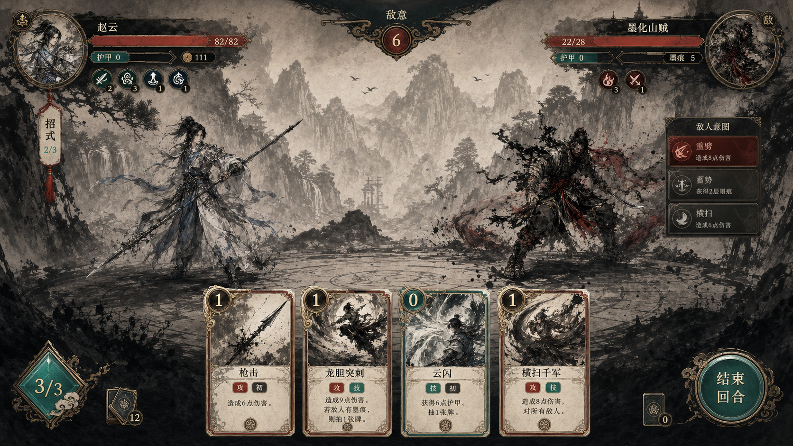

# Combat UI Kit Design

## Goal

Rebuild the first production UI pass around the combat HUD and card hand so 《云水江湖》 reads as a commercial game interface instead of a web page with styled boxes.

The user approved the AI concept direction saved at:

## Player Value

- The most repeated screen, combat, gains a premium first impression.
- Health, resources, enemy intent, status icons, and hand cards become readable without covering the player or enemy standees.
- Cards become authored objects with strong art framing, clear cost/type/rarity zones, and no large empty art margins.
- Future map, shop, reward, relic, event, and compendium polish can reuse the same UI kit instead of accumulating one-off CSS surfaces.

## Approved Direction

Use a dual-delivery art pipeline:

- PSD source files for review and later manual art refinement.
- Runtime transparent PNG/WebP slices plus manifests for implementation.

The target style is premium ink-wash wuxia: xuan paper grain, ink black, cinnabar seals, teal jade accents, antique gold edge light, carved dark wood or worn bronze frames, brush dividers, and restrained glow.

This pass starts with combat HUD and cards. Map and broader run surfaces follow after the combat system establishes the visual language.

## Non-Negotiable Gate

Do not touch production UI code until these design artifacts are approved:

- A high-fidelity battle screen visual target.
- Photoshop-openable PSD source plan for each core component.
- Transparent runtime slice plan with layer names and intended file paths.
- A browser prototype using real game content.
- A local playable or semi-interactive preview showing hover, selected card, enemy intent, status changes, and panel reveal motion.

Code implementation must reproduce the approved prototype rather than inventing styling during coding.

## Art Deliverables

Create source art under a new design source directory, separate from runtime assets:

- `assets/source/ui/combat-hud/combat-hud-kit.psd`
- `assets/source/ui/cards/card-frame-kit.psd`
- `assets/source/ui/icons/status-icon-kit.psd`
- `assets/source/ui/combat-hud/combat-ui-kit-manifest.json`

The PSD files must be openable in Photoshop and use clear layer names. If a generated image begins flat, it must be rebuilt into editable layers before acceptance.

Runtime exports should live under:

- `public/assets/generated/ui/combat-hud/`
- `public/assets/generated/ui/cards/`
- `public/assets/generated/ui/icons/`

The manifest must describe:

- source PSD path
- exported runtime files
- nine-slice inset values
- intended component usage
- hover, disabled, selected, danger, and active variants
- text safe areas
- icon semantic ids
- export dimensions and scale assumptions

## Component Scope

Combat HUD components:

- Player and enemy health plates.
- Resource meter and enemy momentum/intent meter.
- Enemy intent card with attack, block, and special variants.
- Status icon tray below or beside the HUD, never over the body or face of either combatant.
- Deck pile controls for draw, discard, exhaust, and end turn.
- Combat message strip and recent action feedback.

Card components:

- Full card frame with cost seal, rarity mark, type badge, title bar, art window, keyword row, and description area.
- Attack, skill/body, mind, ink, status, and rare/signature visual variants.
- Hover, selected, unplayable, upgraded, and combo-biased states.
- Art window uses cover/crop rules and per-card focal metadata so generated card art does not sit as a narrow image with empty side margins.

Icon components:

- Attack/damage.
- Block/armor.
- Charm.
- Ink mark.
- Mind state.
- Draw.
- Discard.
- Exhaust.
- Resource gain.
- Weak/vulnerable/dodge/guard.

## Layout Design

Desktop combat target:

- Keep the center playfield clear.
- Top edge owns health, intent, and major resource information.
- Character-local status trays sit close to the matching HUD cluster, not on top of standee art.
- Bottom edge owns the hand and end-turn controls.
- Pile counters may remain in the lower-right cluster if they do not compete with cards.
- The player and enemy standees must remain visually dominant in the middle third of the screen.

Card target:

- Cards should feel like physical game objects.
- Art occupies a meaningful upper window and is cropped intentionally.
- Cost, type, rarity, and keyword zones must have fixed locations so cards scan quickly.
- Text areas must have stable dimensions and clamp gracefully.

## Technical Direction

Keep the existing Phaser + DOM architecture for this pass:

- Phaser continues to render the battlefield and combat scene.
- DOM continues to render text-heavy HUD and cards, but consumes bitmap UI kit slices instead of plain CSS panels.
- Use CSS variables for shared color, spacing, motion, and asset paths.
- Use manifest-driven component metadata so later Phaser UI migration can reuse the same source assets and nine-slice values.

Do not migrate all UI to Phaser in this pass. Phaser UI can be considered later for combat-only surfaces after the UI kit is proven.

## Prototype Plan

Before production implementation:

1. Generate two or three style variants if the approved concept needs refinement.
2. Pick one final visual target.
3. Build a browser prototype using real current combat content: Zhao Yun, 墨化山贼, enemy intent, player status icons, and starter hand cards.
4. Show hover/selected/unplayable card states.
5. Show at least one enemy intent state and one damage/status feedback moment.
6. Get user approval.

## Acceptance Criteria

- The user approves the browser prototype and visual target before production code changes.
- PSD source files exist and open as Photoshop-editable layered documents.
- Runtime PNG/WebP exports exist with transparent backgrounds where needed.
- The manifest maps every runtime export to source, usage, and slice metadata.
- Combat HUD no longer covers player or enemy standee bodies.
- Cards no longer show large empty side margins in their art windows.
- Status and attribute concepts use distinct icons instead of only text pills.
- Production implementation keeps existing gameplay behavior unchanged.
- Browser screenshots verify desktop combat layout, card hover/selection, and reward card presentation after the UI kit is wired.

## Out Of Scope

- Full map redesign.
- Full shop, reward, relic, event, logbook, compendium, and title redesign.
- Replacing all 150 card artworks in this pass.
- Full Phaser UI migration.
- Steam packaging or platform work.

## Verification Plan

Design verification:

- Open PSD files in Photoshop or a compatible viewer.
- Inspect exported alpha PNG/WebP files.
- Review the browser prototype at desktop size.
- Confirm the prototype against the approved concept image.

Implementation verification after approval:

- `node node_modules/typescript/bin/tsc --noEmit`
- `NAPI_RS_FORCE_WASI=1 node node_modules/vitest/vitest.mjs run --reporter=dot`
- `NAPI_RS_FORCE_WASI=1 node node_modules/vite/bin/vite.js build`
- Focused Playwright visual smoke for combat and reward cards.
- Manual screenshot review at desktop viewport.
